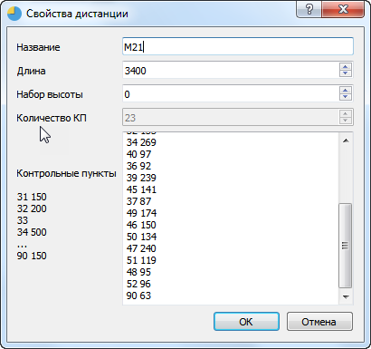
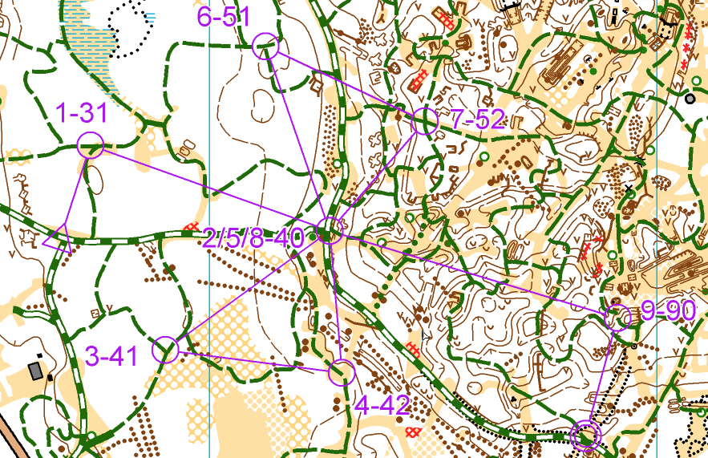

# Проверка отметки

______

На данный момент реализована проверка отметки для различных дисциплин.

По умолчанию порядок прохождения берется через группу участника, из свойств соответствующей дистанции. 

При различных вариантах рассева предусмотрена прямая связь между участником и дистанцией. Это полезно в эстафетах, эстафетах одного участника (OMR), при рассевах типа "бабочка". 
Если номер участника совпадает с названием дистанции, то именно она используется для проверки отметки. Для эстафет также проверяются названия, состоящие из номера команды и номера участника, разделенных точкой 
    
    дистанция "12.1" соответствует участнику с номером 1012
______

***Важное замечание!***

*Старайтесь не использовать без необходимости названия дистанций "1", "2", "3" и т.д. - это может привести к неправильной проверке отметки участников с номерами 1, 2, 3 и т.д.*
______


## ***Заданное направление***

В параметрах дистанции задаются коды КП, которые нужно пройти в заданном порядке.
Пример дистанции из 4 КП:

    31
    32
    33
    34

или с указанием длины перегона в метрах

    31 1992
    32 334
    33 533
    34 121
    
Пример окна редактирования



## ***Заданное направление с бабочкой (небольшой рассев)***



Бабочка `31-40-41-42-40-51-52-40-90` либо `31-40-51-52-40-41-42-40-90`
Можно присвоить каждому участнику свою дистанцию, либо ввести в таком формате (Тут возможно нарушение порядка, например, `31-40-41-52-40-52-41-40-90`, но оно обычно не несет преимущества)

    31
    40
    *(41,51)
    *(42,52)
    40
    *(41,51)
    *(42,52)
    40
    90

## ***Выбор***

Введены два понятия: “уникальный КП” (\*) и “произвольный КП” (%).

* Для классической дистанции по выбору, когда участнику необходимо взять 4 уникальных КП, параметры дистанции имеют следующий вид:

```
*[4]
```

* Если нужно, чтобы первый обязательно был КП 31:

```
31
*[3]
```

* Если нужно, чтобы последний обязательно был КП 90

```
*[3]
90
```

* Если нужно, чтобы был задан список допустимых КП 31-45,55,67

```
*(31-45,55,67)[4]
```

* Первый КП 31, далее произвольные два КП, уникальные на дистанции, последний КП 90

```
*31
*(32-45)[2]
*90
```

* Гибридная дистанция.
Две группы КП по выбору, между ними необходимо взять три КП в заданном порядке. Последний КП 90.

```
*(31-49)[5]
50
51
52
*(31-49)[5]
90 
```

## ***Рогейн***

* Классический вариант с неограниченным количеством уникальных КП
    
```
*[]
```

* Первый и последний КП заданные. В этом случае контрольные пункты, взятые до КП 31 или после КП 90, не учитываются.

```
31
*(32-89)[]
90
```

* Рогейн в два круга.
В этом случае участникам сначала нужно взять любое количество контрольных пунктов из первой группы (31-40),
затем любое количество контрольных пунктов из второй группы (41-50).
Отметка на любом КП из первой группы не учитывается после взятия любого КП из второй группы.

```
*(31-40)[]
*(41-50)[]
```

* Рогейн в два круга с обязательным "переходным" КП

```
*(31-40)[]
90
*(41-50)[]
```

## ***Маркировка без прокола***

* **Вариант А.** Заданное направление.

```
31
32
33
34
```

* **Вариант Г с ТПР.** Порядок прохождения контролируется списком КП в скобках, а штраф начисляется по 1 КП – это правильный вариант.

```
31(31,32,33)
42(41,42,43)
51(51,52,53)
63(61,62,63)
```

* **Вариант Д (2017, Снятие при отсутствии отметки истинного КП).** Аналогично заданному направлению, штраф начисляется за лишние отметки.

```
31
32
33
34
```

* **Вариант Д (модификация 2018, да-нет).** Порядок прохождения контролируется списком КП в скобках, а штраф начисляется по 1 КП – это правильный вариант.

```
31(31,32)
42(41,42)
51(51,52)
61(61,62)
```

## Проверка отметки по всем дистанциям

В параметрах группы нужно выбрать пункт "Любая дистанция".
Тогда отметка будет "Ok", если хотя бы одна дистанция совпала с отметками участника.

